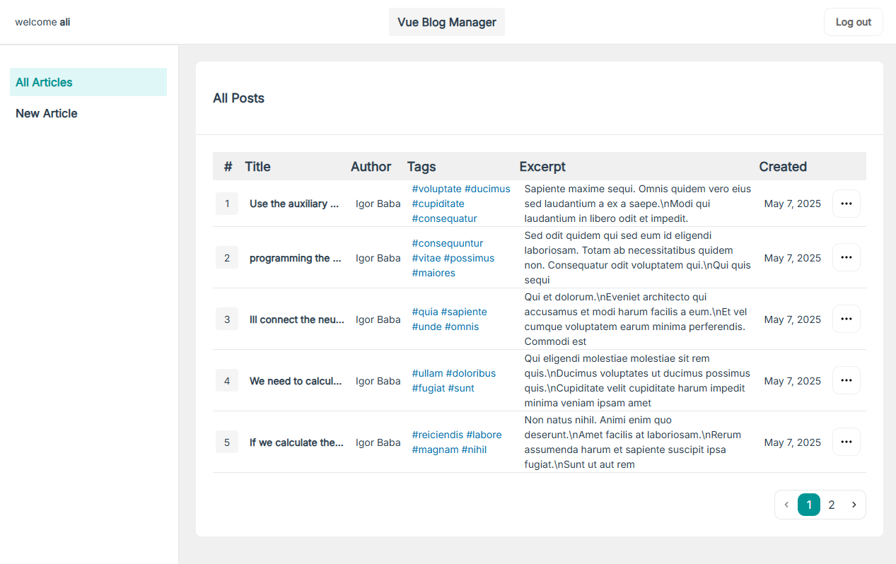
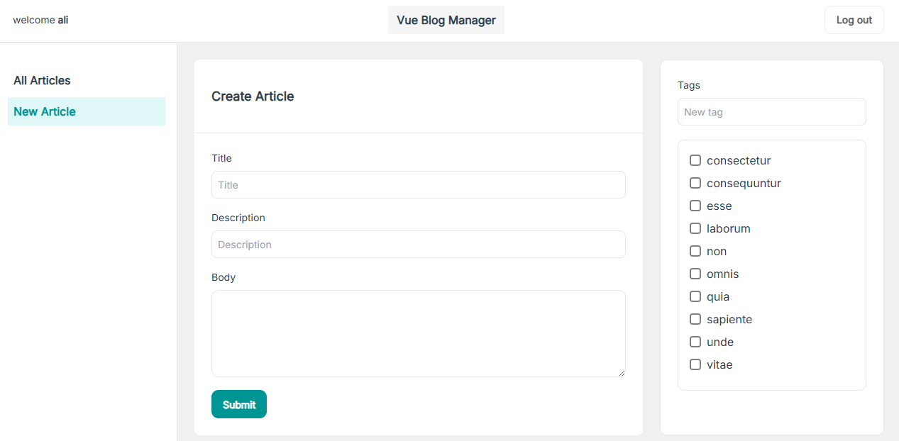

# Vue Blog Manager

A modern blog management system built with Vue.js 3 and TypeScript, featuring a clean and intuitive interface for managing blog posts. This application provides a robust platform for creating, editing, and managing blog content with user authentication.

## Live Demo

Check out the live demo of the application [here](https://ali-toghiani.github.io/vue-blog-manager/).

## Screenshots

Below are some screenshots of the application in action:





## Features

- **User Authentication**
  - Secure login and registration system
  - Token-based authentication
  - Protected routes for authenticated users
  - Persistent user sessions

- **Blog Management**
  - View all blog posts in a responsive table layout
  - Create and edit blog posts
  - Tag management system
  - Post pagination
  - Post excerpts and formatting

- **Modern UI/UX**
  - Clean and responsive design with Tailwind CSS
  - Toast notifications for user feedback
  - Mobile-friendly interface
  - Dropdown menus and interactive components
  - Custom reusable components

## Tech Stack

- Vue.js 3 with TypeScript
- Vuex 4 for state management
- Vue Router 4 for routing
- Axios for API communication
- Tailwind CSS for styling
- SCSS for custom styling
- Vue3-Toastify for notifications

## Project Setup

1. Clone the repository

2. Install dependencies:
```bash
npm install
```

3. Create a `.env` file in the root directory with:
```env
VUE_APP_BASE_API_URL=your_api_url_here
```

4. Run development server:
```bash
npm run serve
```

5. Build for production:
```bash
npm run build
```

6. Lint and fix files:
```bash
npm run lint
```

## Project Structure

```
src/
├── api/          # API configuration and endpoints
├── assets/       # Static assets (images, fonts, styles)
├── components/   # Reusable Vue components
├── layout/       # Layout components (Header, Sidebar)
├── models/       # TypeScript interfaces and types
├── pages/        # Page components
├── router/       # Route configurations
├── store/        # Vuex store modules
└── views/        # View components
```

## Key Components

- `AppTable`: Responsive table component for displaying blog posts
- `AppWidget`: Container component with title and content sections
- `AppButton`: Reusable button component with various styles
- `AppMenu`: Dropdown menu component for actions
- `AppModal`: Modal dialog component
- `AppPagination`: Pagination component for blog posts

## Features in Detail

### Authentication
- Token-based authentication using Vuex store
- Automatic token injection in API requests
- Protected routes with navigation guards

### Blog Management
- Rich text editing for blog posts
- Tag management system
- Post pagination with configurable page size
- Post excerpt generation
- Created date formatting

### Styling
- Responsive design using Tailwind CSS
- Custom SCSS styling
- Consistent UI components
- Mobile-first approach

## Deployment

The project includes a deployment script for GitHub Pages:

```bash
npm run deploy
```

## Contributing

1. Fork the repository
2. Create your feature branch (`git checkout -b feature/AmazingFeature`)
3. Commit your changes (`git commit -m 'Add some AmazingFeature'`)
4. Push to the branch (`git push origin feature/AmazingFeature`)
5. Open a Pull Request

## License

This project is open source and available under the [MIT License](LICENSE).
